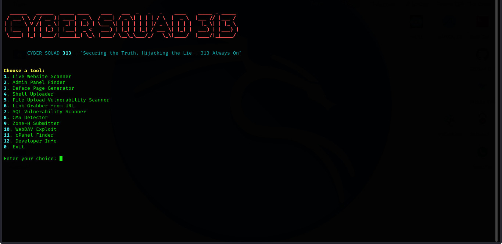

<p align="center">
  
</p>

<p align="center">
  
</p>

<h1 align="center">KAMIKAZE WEB DEFACER v6</h1>
<p align="center"><i>Advanced Exploitation Toolkit by CYBER SQUAD 313</i></p>

---

## ⚡ Overview

**Kamikaze Web Defacer** is a red-team focused CLI toolkit built in Python. It enables security researchers and ethical hackers to automate key web exploitation tasks like panel finding, deface generation, shell uploads, and more.

🧠 Built for research and education  
🔐 Use responsibly

---

## 🔧 Features

| #  | Tool                              | Description                                 |
|----|-----------------------------------|---------------------------------------------|
| 1  | Live Website Scanner              | Bulk scan domains for uptime                |
| 2  | Admin Panel Finder                | Bruteforce common admin paths               |
| 3  | Deface Page Generator             | Auto-create stylish HTML deface files       |
| 4  | Shell Uploader                    | Upload shells to vulnerable endpoints       |
| 5  | File Upload Vulnerability Scanner | Test basic upload forms                     |
| 6  | Link Grabber                      | Scrape all links from a page                |
| 7  | SQL Injection Scanner             | Basic SQLi payload fuzzing                  |
| 8  | CMS Detector                      | Detect WordPress, Joomla, Drupal            |
| 9  | Zone-H Submitter                  | Auto submit defaced URLs to Zone-H          |
| 10 | WebDAV Exploit                    | Upload deface via WebDAV if enabled         |
| 11 | cPanel Finder                     | Check common login panels                   |
| 12 | Developer Info                    | Shows author and support info               |

---

## ⚙️ About

**KAMIKAZE WEB DEFACER v6** is a Python-powered, terminal-based web exploitation suite designed for penetration testers, red teams, and cyber researchers. This tool includes powerful modules to assist in website reconnaissance, shell uploading, vulnerability scanning, and custom HTML defacing.

🔐 Use it for learning, ethical hacking, or lawful testing only.

---

## 📁 GitHub Repository

**Official Repo**: [https://github.com/cyberghosts02/web-deface](https://github.com/cyberghosts02/web-deface)  
**Main Script**: `kamikaze_web_defacer_v6.py`

---

## 🛠 Installation (Linux / Termux / Kali)

```bash
# 1. Clone the repo
git clone https://github.com/cyberghosts02/web-deface
cd web-deface

# 2. (Optional) Create virtual environment
python3 -m venv venv
source venv/bin/activate

# 3. Install required modules
pip install -r requirements.txt

# 4. Run the tool
python3 kamikaze_web_defacer_v6.py


```


*CYBER GHOSTS is a cybersecurity research group led by ALPHA.*
*Specializing in OSINT, penetration testing, and red teaming.*
*Official GitHub: [https://github.com/cyberghosts02]*
